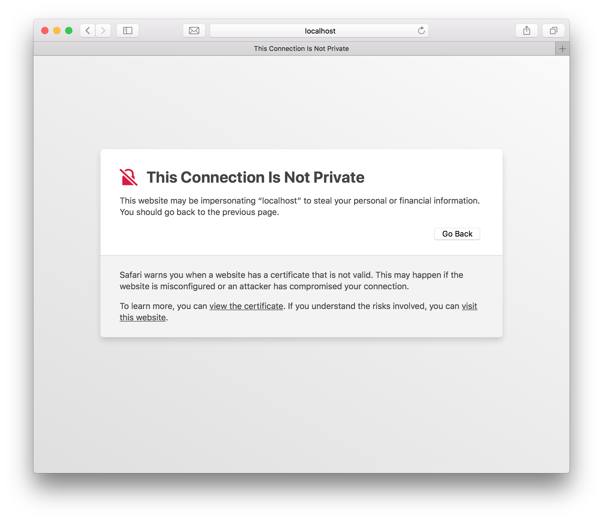

# Browser Configuration

This guide explains how to configure your local browser in order to avoid warnings about insecure self-signed certificates.

### Safari

If you use this with a web server, when you open the site in Safari:

  - Click "View the certificate" to check that it is the correct certificate.
  - Click "visit this website" which will prompt you to add the certificate to your keychain. Once you've done this, it should work for a long time.

### Chrome

If you use this with a web server, when you open the site in Chrome:

  - Click "ADVANCED" to see additional details, including...
  - Click "Proceed to localhost (unsafe)" which will allow you to use the site for the current browser session.

#### Self-Signed Localhost

The best way to use Chrome with self-signed localhost certificates is to allow it in your chrome settings: <chrome://flags/#allow-insecure-localhost>.
